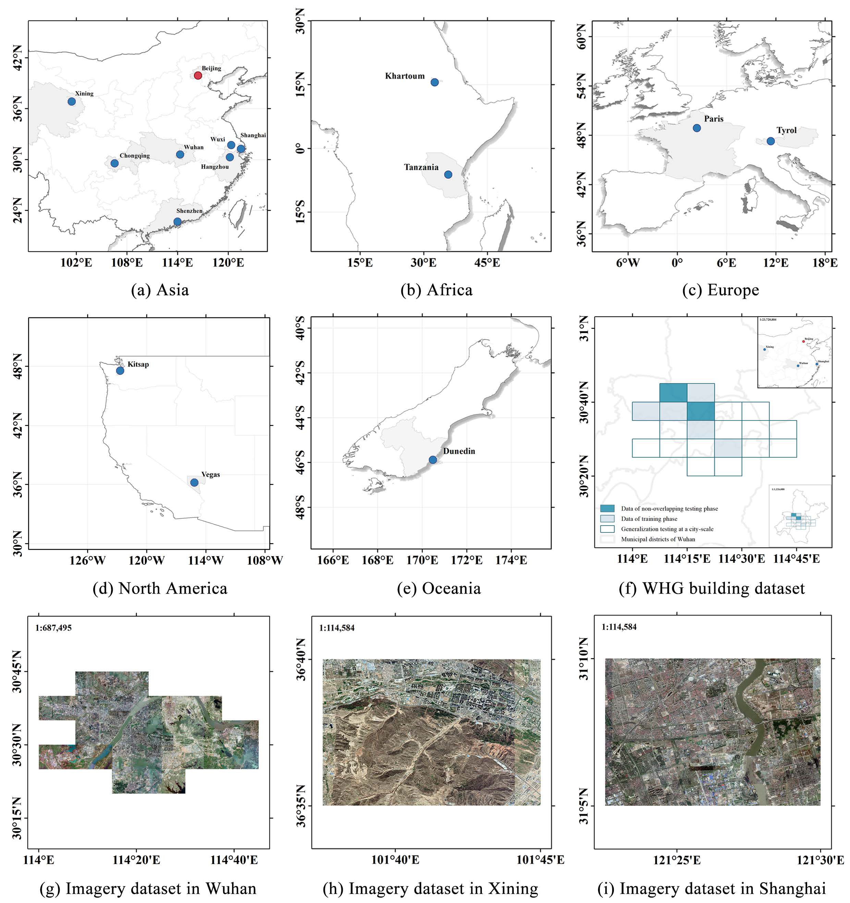

# Vectorized building extraction from high-resolution remote sensing images using spatial cognitive graph convolution model (SCShaping)
Zhuotong Du, Haigang Sui*, Qiming Zhou, Mingting Zhou, Weiyue Shi, Jianxun Wang, Junyi Liu
****


## Highlights
* A spatial cognitive learning method for vectorized building extraction is proposed.
* Enriched topological embedding of graph nodes increases model generalization ability.
* Pooling and up-sampling augmenting feature reuse in graph convolution is introduced.
* Obtain-and-play extraction with accurate coordinates of shapely boundary is accessed.

## Where is the code?
To get the code, please signup via formal email contact (zhuotongd@whu.edu.cn). We will be using GitHub to keep track of issues with the code and to update on availability of newer versions. <br>

If you use this code, please __`Cite`__:
```
@{SCShaping 2024,
title={Vectorized building extraction from high-resolution remote sensing images using spatial cognitive graph convolution model},
author={Zhuotong Du, Haigang Sui*, Qiming Zhou, Mingting Zhou, Weiyue Shi, Jianxun Wang, Junyi Liu},
booktitle={ISPRS Journal of Photogrammetry and Remote Sensing},
year={2024}
}
```

## Installation
CUDA 11.3, Pytorch 1.12.0 <br>
```pip install -r requirements.txt```

## Training & Inference
### Data prepare
* WHU-Mix vector dataset(http://gpcv.whu.edu.cn/data/whu-mix%20(vector)/whu_mix(vector).html)<br>
* BITCC dataset (https://doi.org/10.11922/sciencedb.00620)<br>
* WHG Building dataset (Soon be released)<br>

The structure of the data file should be like:<br>
```
/instance_dataset 
|-- GeoJson in Cityscape format
    |-- train
    |   |-- each file (.json)
    |-- val
    |   |-- each file (.json)
    |-- test
    |   |-- each file (.json)
|-- Images
|-- Binary Labels (optional)  
```

Transfermation from MS-COCO formatted geojson to Cityscape formatted ones: <br>
* Modify param pairs before running codes "{train_json_path, train_val_json_path}", "{train_tiff_dir, train_val_tiff_dir}", "{train_coco, train_val_coco}", "{train_json_dir, train_val_json_dir}"
```
python coco_to_cityscape.py
```
Note: We also provide transfer codes of Cityscape-to-MS COCO for any future possible use: <br>
* Modify param in config file before running codes "DEFAULT_CLASS_INFO", "{train_tiff_dir, train_val_tiff_dir, val_tiff_dir}", "{train_json_dir, train_val_json_dir, val_json_dir}"
```
python cityscape_to_coco.py
```
* Prepare COCO base info files: <br>
```
coco_class_names.txt
our_class_names.txt
```

The transferred structure of a json file should be like:<br>
```
[
  {
    "img_path": str,
    "img_height": numeric,
    "img_width": numeric,
    "label": "building",
    "instance_id": str (img_id + instance_order),
    "img_id": str,
    "split": str (dataset split),
    "components":
                [
                  {
                     "bbox": [xmin, ymin, xmax, ymax],
                     "poly": [[x0,y0], ..., [xi,yi], ..., [x0, y0]], # closed polygon in Python
                     "area": numeric
                  }
                ]
  }
]
```

### Training
* Befor running training stage codes, modify your custom params in general training phase configuration and specific graph-Encoder-Decoder network configuration, such as sampling rate or drop rate of graph layers.
```
python training.py
```

### Inference
* Before running inference stage codes, modify "result_dir" and "reload_pth_path" regarding general configurations, and other params stay consistent with that of the training stage.
```
python Inference.py
```

### Evaluation
* Modify param pairs of inference results paths {predictions & ground truths} for mask-wise metrics as a polygon and boundary generation destination paths {predictions_bound & gt_bounds} for edge-wise metrics as a qualified polygon.
```
python Evaluation.py
```


